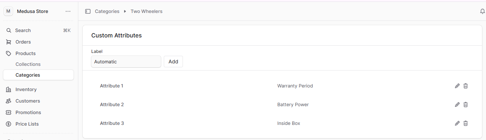
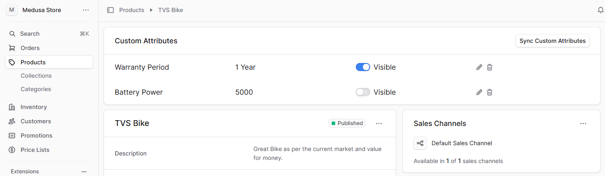

<h1 align="center">Product Custom Attributes</h1>

<p>This plugin provides the ability to manage custom attributes at the <strong>category level</strong>, with the option to <strong>sync those attributes to products</strong> within the category. You can then assign and manage values for each attribute at the product level. Additionally, the plugin allows you to configure the <strong>visibility of attributes on the storefront</strong>, ensuring that only the relevant information is displayed to customers.
</strong></p>

<br />

## Previews
<div style="display:flex; overflow-x: auto; gap: 10px; scroll-snap-type: x mandatory;">
  
  
</div>


## Installation

```
yarn add @linearcommerce/product-custom-attributes

-- OR -- 

npm i @linearcommerce/product-custom-attributes
```

## Compatibility

**To use this plugin, you need to have the minimum versions of the following dependencies:**

```json
"@medusajs/admin-sdk": "^2.8.2",
"@medusajs/cli": "^2.8.2",
"@medusajs/framework": "^2.8.2",
"@medusajs/icons": "^2.8.2",
"@medusajs/js-sdk": "^2.8.2",
"@medusajs/medusa": "^2.8.2",
```

## Usage

#### Add the plugin to your `medusa-config.ts` file:

```ts
plugins: [
  {
    resolve: '@linearcommerce/product-custom-attributes',
    options: {},
  },
],
```

#### Run the database migrations (Adds a table to your database for storing custom attributes):

```
npx medusa db:migrate
```


## Key Features:

- Define and manage custom attributes at the category level.  
- Automatically sync category attributes to associated products and manage their values seamlessly.  
- Leverage a flexible structure that supports diverse use cases, including product specifications, category-specific filters, and additional descriptive fields.  

This plugin is particularly valuable for stores that need functionality beyond Medusa’s default product and category fields. It empowers you to extend and customize your catalog, ensuring it aligns with your unique business requirements.

